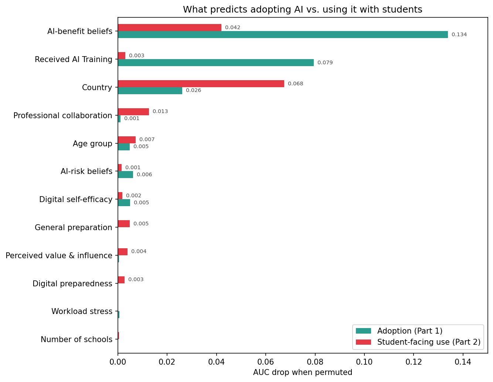
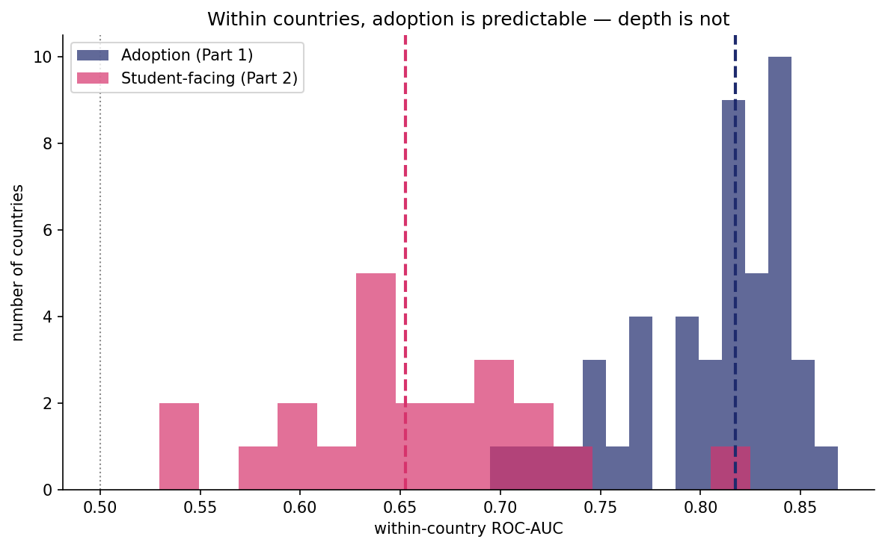
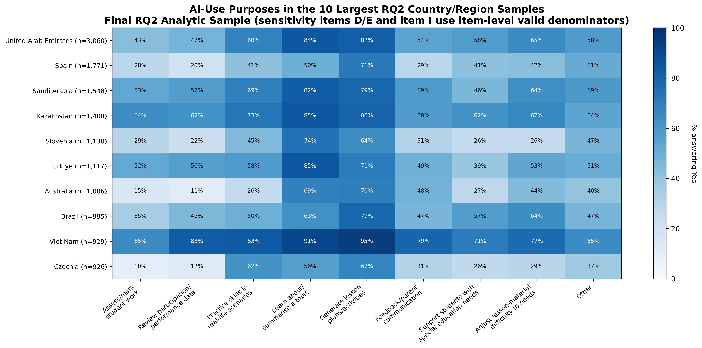
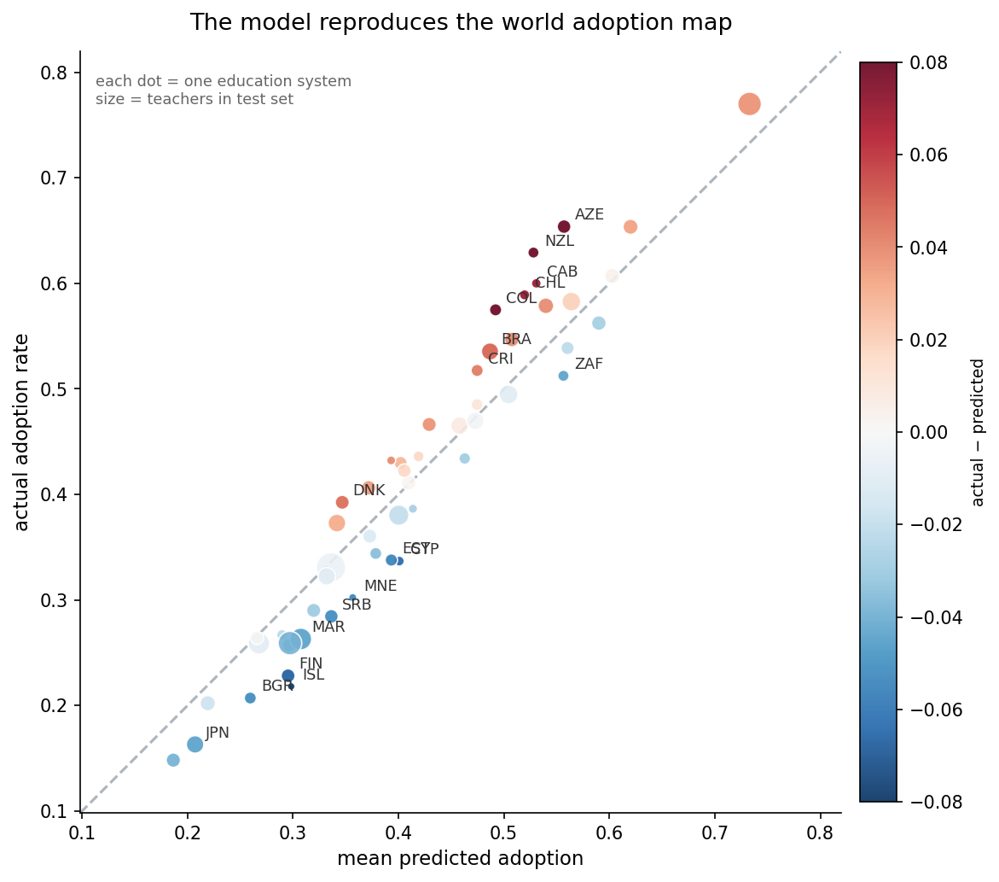
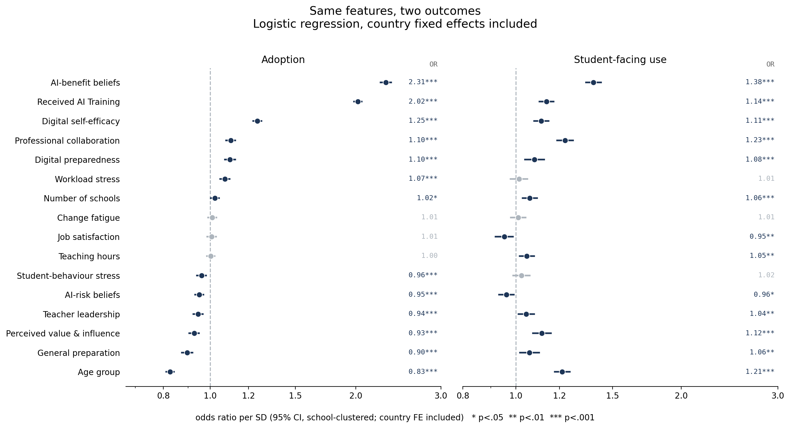

# Which Teachers Adopt AI and Which Ones Trust It With Students?

An Erdős Institute Summer 2026 data-science project using the **OECD TALIS 2024** teacher survey
(278,383 teachers, 55 countries/education systems). We model teachers' AI use in two parts and
identify what drives it.

**Team Members:**<br>
[Ruiping Huang](https://github.com/ruiping935)<br>
[Elif Yegenoglu](https://github.com/elifyegenoglu1)<br>
Dominic Kwesi Quainoo

## Research questions

- **RQ1 - Adoption:** Which factors predict whether a teacher used AI in their teaching in the
  last 12 months? (TT4G36, binary; n = 75,817)
- **RQ2 - Scope of adoption:** Among teachers who use AI, whose use reaches students directly?
  (TT4G37 items A/G/H; n = 30,689)

## Key results

- Adoption is predictable: **AUC 0.833 ± 0.001**. Perceived usefulness (AI-benefit beliefs,
  OR 2.31) and AI-specific training (OR 2.02) lead; three questions recover almost the whole
  model (AUC 0.828 of 0.836).
- Scope is harder: **AUC 0.745**, and the structure inverts — training's contribution collapses
  and country context becomes the top predictor. Within countries, adoption stays predictable
  (median AUC 0.818) while student-facing use does not (0.653).
- Risk beliefs, from the same survey battery as benefit beliefs, predict almost nothing — the
  asymmetry that answers the circularity concern.

What predicts adopting AI is not what predicts using it with students:





What that use looks like, per country — teacher-facing purposes (summarising, lesson plans)
dominate everywhere, while student-facing purposes vary far more:



And the adoption model recovers real cross-country variation:



The full story: [project presentation (PDF)](Erdos%20Project%20Presentation%20-%20Teacher's%20AI%20Adoption.pdf)
and the [executive summary (PDF)](Erdos%20Project%20Executive%20Summary.pdf).

## Quick start

```
pip install -r requirements.txt
```

1. Get the data (two routes, see `Data/README.md`): download the prebuilt merged file from our
   Drive folder into `Data/output/`, **or** download the raw TALIS files from OECD and run
   `Model/01_build_dataset.ipynb` once.
2. Open any numbered notebook and **Run All** — paths are repo-relative and work on any machine.

## Repository structure

```
├── EDA/                      # exploratory analysis (Ruiping)
│   └── TALIS_EDA_Final.ipynb         #   reads the OECD teacher CSV + codebook, writes to EDA/output/
├── Model/                    # modeling, results, robustness (Elif)
│   ├── output/                       # figures the notebooks generate (gitignored)
│   ├── 01_build_dataset.ipynb        # raw .sav -> merged CSV (run once)
│   ├── 02_model.ipynb                # samples, split, tiers, bake-offs, Part 2 model
│   ├── 03_results.ipynb              # every figure and table in the deck
│   ├── 04_robustness.ipynb           # null shuffles, seed stability, sensitivity, balance
│   ├── 05_school_block_check.ipynb   # school variables: value vs cost
│   ├── 06_weight_sensitivity.ipynb   # TCHWGT weighted vs unweighted
│   ├── 07_experiments.ipynb          # runnable versions of the key experiments
│   └── README.md                     # run order and details
│                      
├── Data/                     # codebook + small CSVs; merged data in Data/output (gitignored)
├── Figures/                  # the figures embedded in this README
└── presentation + executive summary PDFs
```

Notebooks 03/04/05/07 start with setup cells copied from 02 so each runs standalone.

## Data

- Source: [OECD TALIS 2024](https://www.oecd.org/en/data/datasets/talis-2024-database.html) —
  teacher and principal files, all ISCED levels (primary, lower and upper secondary).
- Raw files (~0.4–0.6 GB each) and the 1.6 GB merged file are **gitignored**; the repository
  ships instructions, not data. `Data/README.md` covers placement (`Data/SPSS/` for .sav,
  `Data/CSV/` for the OECD CSV the EDA uses) and the Drive folder with all required files.
- **Split-form design:** the AI module (Q35/Q36/Q37) was administered to a random ~1/3 of
  teachers (Form A). Assignment is random across countries (checked), so restricting to the
  administered sample is unbiased — but it gates several would-be predictors that sit on other
  forms, and it means estimates describe the analytic sample rather than national populations.

## Methods in one paragraph

Outcomes: RQ1 = TT4G36 yes/no; RQ2 = any of three student-facing purposes (assess/mark work,
review student data, skill practice) among AI users, with a sensitivity check for two ambiguous
items. Features: 18 teacher-level variables including two belief composites built from the Q35
battery ("don't know" → 2.5 midpoint). Split: school-grouped 70/30 (schools never straddle
train/test; all |SMD| < 0.03). Model: GradientBoosting, winner of a grouped 5-fold CV bake-off
across 7 families; odds ratios from school-clustered logistic regressions with country fixed
effects. Robustness: null-target shuffles (~0.50 both parts), 10-seed stability, outcome-definition
sensitivity (ρ = 0.93), weighted-vs-unweighted checks in both estimation and evaluation.

The same features, two outcomes — per-SD odds ratios from school-clustered logits with country
fixed effects:

| Predictor (per SD) | Adoption OR | Student-facing OR |
|---|---|---|
| AI-benefit beliefs | 2.31*** | 1.38*** |
| Received AI training | 2.02*** | 1.14*** |
| Age group | 0.83*** | 1.21*** |



## Limitations

Self-reported AI use (recall and social-desirability bias); the Form-A subsample describes the
analytic sample, not national populations; school-level context is unavailable across all
systems, so country effects absorb policy, infrastructure, and norms; weighted and unweighted
results are similar except upper-secondary estimates, which are weight-sensitive; the data are
cross-sectional — associations, not causes (beliefs and use are measured simultaneously, and
reverse causality is possible).
